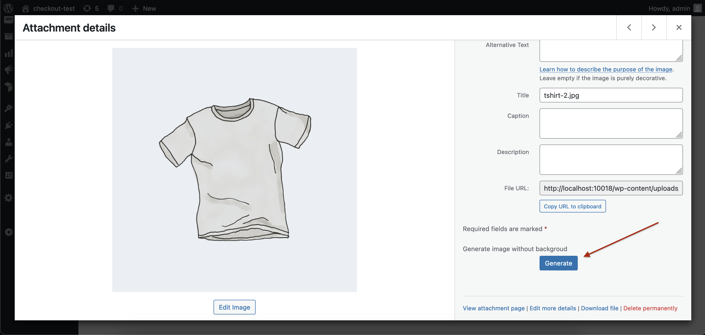

# Background Image Remover Plugin

The Background Image Remover Plugin seamlessly integrates with our [Python Script](https://github.com/ChakibAA/Background-remover-Python-Script) to provide enhanced functionality. This integration allows users to perform background removal tasks remotely and retrieve results through API calls.

